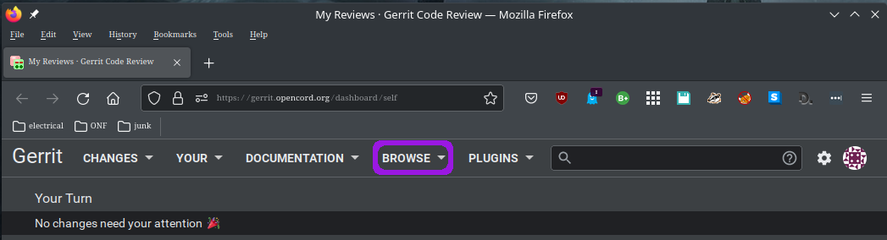
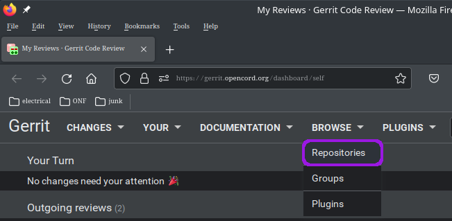
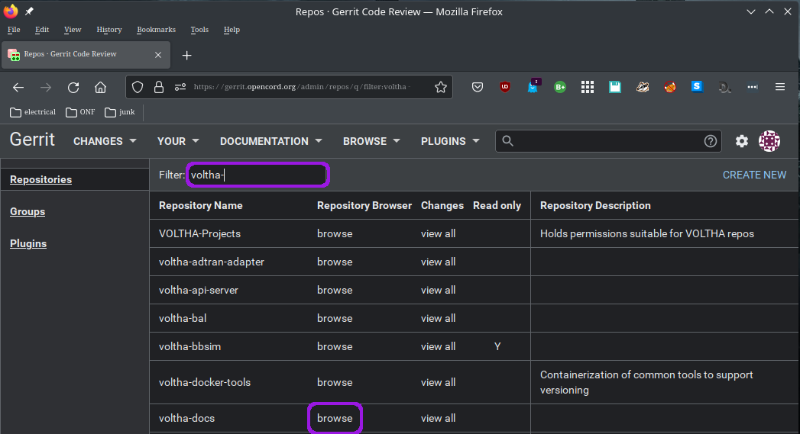

.. _voltha_repositories:

VOLTHA project repositories
===========================

Finding a repository to work with
---------------------------------

Navigate to the VOLTHA repositories on gerrit or github:
++++++++++++++++++++++++++++++++++++++++++++++++++++++++
- :vol-ger:`voltha-docs`
- :vol-git:`voltha-docs`

- https://github.com/opencord/voltha-docs

|

Visit gerrit.opencord.org/dashboard
"""""""""""""""""""""""""""""""""""

|

From the BROWSE pull-down menu select Repositories
""""""""""""""""""""""""""""""""""""""""""""""""""

|

In the Filter: box search for 'voltha-'
"""""""""""""""""""""""""""""""""""""""

- Click browse to view repository clone command and available versions.
- Click branch=master to browse the code base.

|

Github
++++++
A mirror of the VOLTHA gerrit repositories can also be found on github.

- https://github.com/opencord/voltha-docs

  - Gerrit repositories can also be accessed through a mirror on github.
