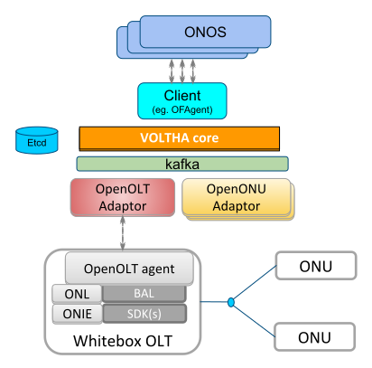

VOLTHA Documentation
====================

`VOLTHA (Virtual OLT Hardware Abstraction
<https://www.opennetworking.org/voltha/>`_ is an open source project to create a
hardware abstraction for broadband access equipment. It supports the principle
of multi-vendor, disaggregated, "any broadband access as a service" for the
Telco Central Office.

Key concepts in VOLTHA:

- **Network as a Switch**: It makes a set of connected access network devices
  to look like a SDN programmable switch.

- **Evolution to virtualization**: it can work with a variety of access network
  technologies and devices

- **Unified OAM abstraction**: it provides unified, vendor- and technology
  agnostic handling of device management tasks, such as service lifecycle,
  device lifecycle (including discovery, upgrade), system monitoring, alarms,
  troubleshooting, security, etc.

- **Cloud/DevOps bridge to modernization**: it does all above while using a
  microservices architecture running on top of Docker and/or Kubernetes.

VOLTHA is a sub-project of the `Open Networking Foundation's
<https://www.opennetworking.org>`_ `CORD project
<https://www.opennetworking.org/cord/>`_.

   VOLTHA Component Diagram

Community
---------

Information about participating in the VOLTHA community and development process
can be found on the `VOLTHA section of the CORD Wiki
<https://wiki.opencord.org/display/CORD/VOLTHA>`_.

.. toctree::
   :maxdepth: 1
   :caption: Overview
   :hidden:
   :glob:

   overview/*
   readme

.. toctree::
   :maxdepth: 1
   :hidden:
   :caption: Components

   bbsim/docs/source/index.rst
   ofagent-go/README.md
   openolt/README.md
   voltha-openolt-adapter/README.md
   voltctl/README.md
   voltha-protos/README.md

.. toctree::
   :maxdepth: 1
   :hidden:
   :caption: Testing

   voltha-system-tests/README.md
   testing/index.rst

.. toctree::
   :maxdepth: 1
   :hidden:
   :caption: Releases
   :glob:

   release-notes/*
