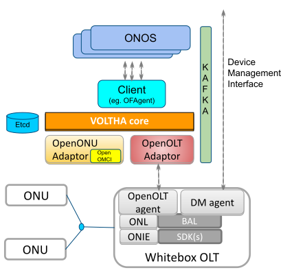

VOLTHA Documentation
====================

`VOLTHA (Virtual OLT Hardware Abstraction
<https://www.opennetworking.org/voltha/>`_ is an open source project to create a
hardware abstraction for broadband access equipment. It supports the principle
of multi-vendor, disaggregated, "any broadband access as a service" for the
Telco Central Office.

Key concepts in VOLTHA:

- **Network as a Switch**: It makes a set of connected access network devices
  to look like a SDN programmable switch.

- **Evolution to virtualization**: it can work with a variety of access network
  technologies and devices

- **Unified OAM abstraction**: it provides unified, vendor- and technology
  agnostic handling of device management tasks, such as service lifecycle,
  device lifecycle (including discovery, upgrade), system monitoring, alarms,
  troubleshooting, security, etc.

- **Cloud/DevOps bridge to modernization**: it does all above while using a
  microservices architecture running on top of Docker and/or Kubernetes.

VOLTHA is a sub-project of the `Open Networking Foundation's
<https://www.opennetworking.org>`_ `CORD project
<https://www.opennetworking.org/cord/>`_.

   VOLTHA Component Diagram

Here some quick links to get you started:

- :doc:`./overview/architecture_overview`
- :doc:`./overview/deployment_environment`
- :doc:`./overview/troubleshooting`

Community
---------

VOLTHA is an open source project led by a technical steering team that holds weekly meetings.
You can find more information about the TST, community, meetings, mailing lists and slack channels
in the `VOLTHA wiki page <https://wiki.opennetworking.org/display/COM/VOLTHA>`_

.. toctree::
   :maxdepth: 1
   :caption: Overview
   :hidden:
   :glob:

   overview/architecture_overview.rst
   overview/deployment_environment.rst
   Deploy VOLTHA <voltha-helm-charts/README.md>
   overview/workflows.rst
   overview/operate.rst
   overview/lab_setup.rst
   overview/troubleshooting.rst
   overview/releases.rst

.. toctree::
   :maxdepth: 1
   :hidden:
   :caption: Components

   BBSIM <bbsim/docs/source/index.rst>
   OpenFlow Agent <ofagent-go/README.md>
   OpenOlt Adapter <voltha-openolt-adapter/README.md>
   OpenOnu Adapter Go <voltha-openonu-adapter-go/README.md>
   Openolt Agent <openolt/README.md>
   VOLTHA CLI <voltctl/README.md>
   VOLTHA Protos <voltha-protos/README.md>

.. toctree::
   :maxdepth: 1
   :hidden:
   :caption: Operations

   operations/software-upgrade.rst
   ONU software update <voltha-openonu-adapter-go/docs/ONU_Upgrade_Notes.md>
   ONU Performance Metrics <voltha-openonu-adapter-go/docs/PM_Notes.md>

.. toctree::
   :maxdepth: 1
   :hidden:
   :caption: Testing

   VOLTHA system tests <voltha-system-tests/README.md>
   testing/index.rst

.. toctree::
   :maxdepth: 1
   :hidden:
   :caption: Logging

   logging/centralised_log_analysis.rst
   ONU adapter per package logging <voltha-openonu-adapter-go/docs/Specific_Logging_Notes.md>

.. toctree::
   :maxdepth: 1
   :hidden:
   :caption: Device Management Interface

   Overview <device-management-interface/README.md>
   Image management <device-management-interface/docs/DeviceImageManagement.md>
   Events and Metrics <device-management-interface/docs/EventsMetrics.md>
   Managing a device <device-management-interface/docs/ManagingDevice.md>
   Examples <device-management-interface/docs/Examples.md>
   Guidelines <device-management-interface/docs/RpcGuidelines.md>
   Implementation on BBSIM <bbsim/docs/source/DMI_Server_README.md>

.. toctree::
   :maxdepth: 1
   :hidden:
   :caption: Releases
   :glob:

   release_notes/*
