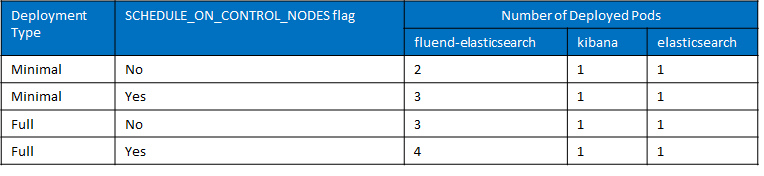
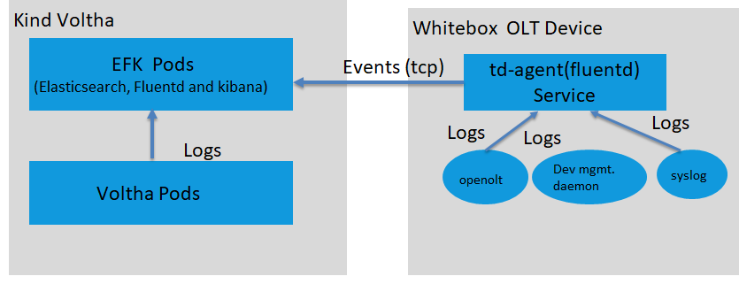

Centralized Log Analysis
========================

Objective
---------

Operators should be able to view logs from all the VOLTHA components as
well as from whitebox OLT devices in a single stream.

Solution Approach For Voltha Ecosystem
--------------------------------------

The solution we have chosen EFK (elasticsearch, kibana and
fluentd-elasticsearch) setup for voltha enables the Operator to push
logs from all VOLTHA components.

Kind-Voltha script enables Operator to setup EFK with minimal
configuration.The configuration set for EFK in minimal-values.yaml or
full-values.yaml start efk stack with a single node elasticsearch and
kibana instance will be deployed and a fluentd-elasticsearch pod will be
deployed on each node that allows workloads to be scheduled.If you have
the prerequisites installed, just execute

.. code:: bash

   $ DEPLOY\_K8S=y WITH\_BBSIM=y WITH\_EFK=y ./voltha up

and the minimal cluster with efk should start.

The number of deployed Pods will be dependent on the value of Deployment
Type and SCHEDULE\_ON\_CONTROL\_NODES flag as shown in the below table.

To remove voltha efk use DEPLOY\_K8S=y ./voltha down or, to avoid
removing the k8s cluster DEPLOY\_K8S=n WITH\_EFK=y ./voltha down

**To start using Kibana, In your browser ,navigate to
http://<k8s\_node\_ip>:<exposed\_port>.** Then you can search for events
in the *Discover* section.

Solution Approach For Whitebox OLT Device
-----------------------------------------

The solution approach we have chosen is to install td-agent (fluentd
variant) directly on OLT device for capturing and transmitting logs to
elasticsearch pod running in voltha cluster.

Created custom td-agent configuration file to handle the format of
involved log files using right input plugins for openolt process, dev
mgmt daemon, system logs and elasticsearch output plugin.You can find
custom td-agent configuration file in
`*https://github.com/opencord/openolt/tree/master/logConf* <https://github.com/opencord/openolt/tree/master/logConf>`__
and find installation steps in
`*https://github.com/opencord/openolt/tree/master* <https://github.com/opencord/openolt/tree/master/logConf>`__
README.

Log Collection from VOLTHA Ecosystem and Whitebox OLT Device
------------------------------------------------------------

Below diagram depicts the log collection from voltha components and
whitebox OLT device through EFK.The fluentd pod running kind-voltha
setup collects logs from all the voltha components and push to
elasticsearch pod.The td-agent(fluentd variant) service running on
whitebox OLT device capture the logs from openolt agent process, device
mgmt daemon process and system logs and transmits the logs to the
elasticsearch pod running in voltha cluster over tcp protocol.

Secure EFK setup and transport of Logs from OLT device
------------------------------------------------------

The Operator can enhance the setup by making configuration changes with
the requirement.

The Authentication, Authorization, and Security features for EFK can be
enabled via X-Pack plugin and Role Based Access Control (RBAC) in
Elasticsearch.The transmission of logs from the Whitebox OLT device can
be secured by enabling tls/ssl encryption with EFK setup and
td-agent.Refer following link for Security features.
`*https://www.elastic.co/guide/en/elasticsearch/reference/current/elasticsearch-security.html* <https://www.elastic.co/guide/en/elasticsearch/reference/current/elasticsearch-security.html>`__

To enable TLS/SSL encryption for elasticsearch pod refer the following
link

`*https://github.com/elastic/helm-charts/tree/master/elasticsearch/examples/security* <https://github.com/elastic/helm-charts/tree/master/elasticsearch/examples/security>`__

To enable TLS/SSL encryption for kibana pod refer the following link

`*https://github.com/elastic/helm-charts/tree/master/kibana/examples/security* <https://github.com/elastic/helm-charts/tree/master/kibana/examples/security>`__

To enable TLS/SSL encryption for fluentd pod and td-agent service refer
following link

`*https://github.com/kiwigrid/helm-charts/tree/master/charts/fluentd-elasticsearch* <https://github.com/kiwigrid/helm-charts/tree/master/charts/fluentd-elasticsearch>`__

Note: create certs directory in /etc/td-agent on the OLT device and copy
the elastic-ca.pem certificate.

Archive of Logs
---------------

There are various mechanisms available with EFK to save data.For example
operators can use **reporting feature** to generate reports of saved
search as CSV documents, that can be transferred to a support
organization via email.You can save searches with time-boxed or with
filtering the required fields then generate the report.To use reporting
features refer the following link
`*https://www.elastic.co/guide/en/kibana/current/reporting-getting-started.html* <https://www.elastic.co/guide/en/kibana/current/reporting-getting-started.html>`__

Note: By default a 10mb of CSV file can be generated.To generate > 10mb
of file enable x-pack plugin and rbac.To generate larger files need to
have a bigger cluster configuration for the elasticsearch pod.The java
heap space,cpu and memory need to be increased with the CSV file size.
