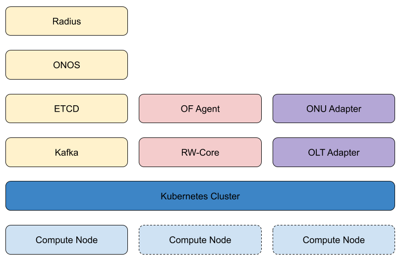

VOLTHA Deployment Environment
=============================

All the components in the VOLTHA project are containerized and the default
deployment environment is ``kubernetes``.

Generally VOLTHA is installed in one of two setups:

- A physical ``kubernetes`` cluster, generally used for production deployments.
- A virtual ``kind`` cluster, generally used for development.

Regardless of the chosen environment the deployment process is the same,
more on this later, and the installation can be managed in the same way.

VOLTHA deployment
-----------------

VOLTHA components on top of ``kubernetes`` are managed via ``helm`` charts.
For more information about ``helm`` please refer to the `Official Documentation <https://helm.sh>`_.

For the sake of this guide, ``helm`` chart simply describe requirements to
deploy a component on top of ``kubernetes``:

- containers
- exposed ports
- configuration parameters.

A VOLTHA deployment is composed, at its very minimum, by:

* Infrastructure

   * A ``kafka`` cluster (can also be a single node)
   * An ``etcd`` cluster (can also be a single node)
   * ``ONOS`` (single or multi instance)
   * [Optional] ``radius`` (for EAPOL based authentication)
* ``VOLTHA``

   * ``voltha-core`` and ``ofAgent`` (contained in the same ``helm`` chart)
* Adapters

   * [one or more] adapter pair(s) (OLT adapter + ONU Adapter)

   VOLTHA Kubernetes deployment

Note that the ``Infrastructure`` components can be deployed outside of the
``kubernetes`` cluster.

You can read more about VOLTHA deployments in:

- :doc:`lab_setup`
- `Deployment with HELM <../voltha-helm-charts/README.md>`_

.. toctree::
   :maxdepth: 1
   :hidden:
   :glob:

   ./lab_setup.rst
   Deploy VOLTHA <../voltha-helm-charts/README.md>
