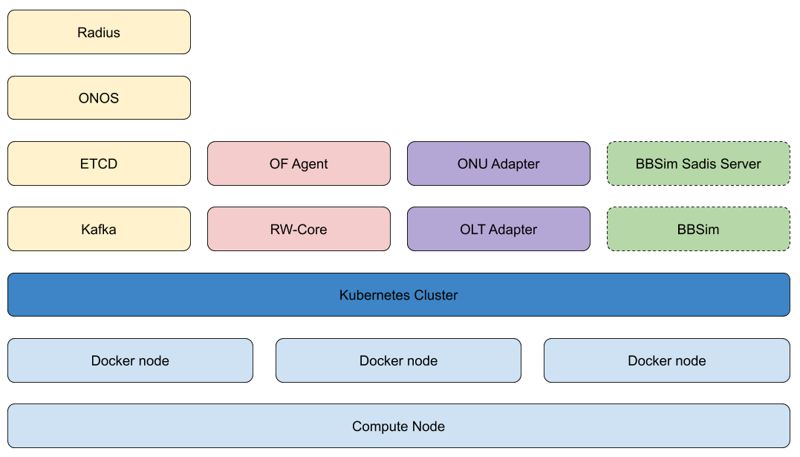

.. _dev_virtual:

Developing code with a virtual VOLTHA POD
=========================================

A guide to install a virtual POD. A virtual pod is generally used to gain familiarity with the
environment or for development and testing purposes.

How is it different from a Physical deployment?
-----------------------------------------------

The main difference is in the ``kubernetes`` cluster itself.
In a Physical deployment we assume that the ``kubernetes`` cluster is installed
on 3 (or mode) physical nodes.
When installing a ``virtual`` cluster we refer to a ``kind`` (``kubernetes-in-docker``)
cluster.

Another common difference is that a Physical deployment is generally associated
with one or more physical OLTs while a Virtual deployment normally emulates the
PON network using :doc:`BBSim <../bbsim/docs/source/index>`.

   VOLTHA Kubernetes kind deployment

Note that is anyway possible to connect a physical OLT to a virtual cluster, as
long as the OLT is reachable from the ``kind`` host machine. If you need to control
your OLT "in-band" then it's not advised to connect it to a virtual cluster.

Quickstart
----------

Requires:

- ``docker`` and ``go`` installed on your machine
- `kind-voltha <https://gerrit.opencord.org/gitweb?p=kind-voltha.git>`_ cloned
  on your machine

.. code:: bash

    TYPE=minimal WITH_RADIUS=y CONFIG_SADIS=y WITH_BBSIM=y ./voltha up

For more information you can visit the :doc:`kind-voltha page <../kind-voltha/README>`.

Developing changes on a virtual pod
-----------------------------------

We assume you already have downloaded the git repository you want to modify and
your IDE is correctly set up.

In this tutorial we are going to use ``voltha-go`` as an example.

Make the required changes in the ``voltha-go`` repository (the process
is the same for all the VOLTHA repositories) to the code and build the
docker images and push them on your private dockerhub account:

.. code:: bash

   $ DOCKER_REGISTRY="matteoscandolo/" DOCKER_TAG="dev" make docker-build

Then push them to your docker hub account:

.. code:: bash

   $ DOCKER_REGISTRY="matteoscandolo/" DOCKER_TAG="dev" make docker-push

Deploy your changes on kind-voltha
----------------------------------

Create a copy of the `minimal-values.yaml` file:

.. code:: bash

    $ cp minimal-values.yaml dev-values.yaml

And edit that file so that it contains the appropriate values for the images you want to try,
for example uncomment and change these two lines (mind the indentation):

.. code:: yaml

    images:
      ro_core:
        repository: matteoscandolo/voltha-ro-core
        tag: dev
      rw_core:
        repository: matteoscandolo/voltha-rw-core
        tag: dev

Then redeploy `kind-voltha` using that the edited value file:

.. code:: bash

    $ DEPLOY_K8S=no ./voltha down && DEPLOY_K8S=no EXTRA_HELM_FLAGS="-f dev-values.yaml" ./voltha up
