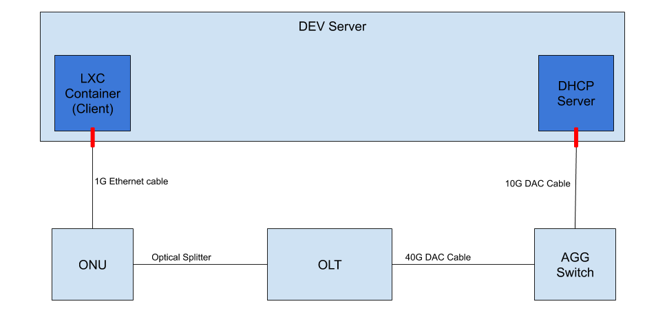

.. _lab_setup:

Hardware Setup of a VOLTHA Test Pod
===================================

Overview
--------

In a testing setup rather than using a real RG or BNG emulated ones are
deployed on a Linux development server:

- The ``RG`` can be emulated by an ``lxc`` container (from now on ``client``)
- The ``BNG`` can be emulated by a Linux server
- The ``AggSwitch`` is mandatory if control of the OLT is done with ``in-band`` mode, while
  optional if the OLT is controlled out of band, in this case the NNI port of the OLT will go directly
  into the emulated BNG linux server NIC card.

   VOLTHA Lab Setup

*The image above represents the data plane connections in a LAB setup.
It does not include the ``kubernetes`` cluster for simplicity, but the ``dev server``
listed above can be one of your ``kubernetes`` nodes.*

What you’ll need to emulate E2E traffic is:

- 1 x86 server with Ubuntu 16.04 and at least the following interfaces:

  - 1 1G Ethernet port
  - 1 10G Ethernet port (this can be a second 1G interface as long as you have a media converter)

.. _setting-up-a-client:

Setting up a client
-------------------

The first thing you need to do is to install ``lxd`` on your server. To do that
you can follow `this guide
<http://tutorials.ubuntu.com/tutorial/tutorial-setting-up-lxd-1604>`_

Once ``lxd`` is successfully installed you need to initialize it with:

.. code:: bash

   lxd init

we recommend to use all the provided default values.

Once ``lxd`` is initialized you can create a container and assign a physical
Ethernet interface to the container:

.. code:: bash

   lxc launch ubuntu:16.04 <name>
   lxc config device add <name> eth1 nic name=eth1 parent=<physical-intf> nictype=physical

Where:

- ``name`` is the desired container name. The convention used to identify which
  RG container is connected to an ONU is to use the ONU serial number as the
  lxc container name.

- ``physical-intf`` is the name of the interface on the server where the ONU
  is physically connected

Once the container is created you can check it's state with with ``lxc list``:

.. code:: bash

   +---------------+---------+--------------------+------+------------+-----------+
   |     NAME      |  STATE  |        IPV4        | IPV6 |    TYPE    | SNAPSHOTS |
   +---------------+---------+--------------------+------+------------+-----------+
   | voltha-client | RUNNING | 10.63.3.144 (eth0) |      | PERSISTENT | 0         |
   +---------------+---------+--------------------+------+------------+-----------+

Please make sure the container has an assigned IP or we it won’t be able
to login and install the ``wpasupplicant`` tool inside the RG.

Once the container is running you need to enter it for configuration. To access
the container run: ``lxc exec <name> /bin/bash``

Once inside:

.. code:: bash

   # activate the interface
   ip link set eth1 up

..

If you want to setup the container for the DT workflow please add a tagged interface to be used to send out traffic.

.. code:: bash

   # setup tagged client interface
   ip link add link eth1 name eth1.7 type vlan id 7
   ip link set eth1.7 up

..

The container also requires some tools for testing

.. code:: bash

   # install the required tools for testing
   apt update
   apt install -y wpasupplicant jq netsniff-ng build-essential tcpdump

..

In the lxc container you also need to install iperf3. Iperf3 needs to be installed from source to have some
options used in VOLTHA tests.

.. code:: bash

    git clone https://github.com/esnet/iperf.git -b 3.9
    cd iperf
    ./configure && make && sudo make install
    ldconfig

..

   NOTE:

   - ``wpasupplicant`` is a Linux tool to perform 802.1X authentication. `wpasupplicant documentation can be found here <https://help.ubuntu.com/community/WifiDocs/WPAHowTo>`_.
   - ``jq`` is a linux tool to perform json parsing. `More information on jq <https://stedolan.github.io/jq/>`_
   - ``netsniff-ng`` installs maushezan, a linux tool to perform traffic generations. `More informations on mz <https://man7.org/linux/man-pages/man8/mausezahn.8.html>`_
   - ``iperf3`` is a linux tool to perform speed tests. `More information on iperf3 <https://iperf.fr/>`_

Create a configuration file for ``wpasupplicant`` in
``/etc/wpa_supplicant/wpa_supplicant.conf`` with the content:

.. code:: text

   ctrl_interface=/var/run/wpa_supplicant
   eapol_version=1
   ap_scan=0
   fast_reauth=1
   network={
           key_mgmt=WPA-EAP
           eap=MD5
           identity="user"
           password="password"
           ca_cert="/etc/cert/cacert.pem"
           client_cert="/etc/cert/client.pem"
           private_key="/etc/cert/client.key"
           private_key_passwd="whatever"
           eapol_flags=3
   }

..

   NOTE: The configuration in this file is not really important if you are
   using the ``freeradius`` server provided as part of the VOLTHA helm charts.
   Do not worry if the certificates do not exist, they won’t affect
   authentication as that is password based.

At this point you’ll be able kickoff the authentication process (by
sending ``EAPOL`` packets into the system) with the command:

.. code:: bash

   wpa_supplicant -i eth1 -Dwired -c /etc/wpa_supplicant/wpa_supplicant.conf

If everything has been set up correctly, you should see output similar to this
in the VOLTHA logs:

.. code:: bash

   cord@node1:~$ kubectl logs -f -n voltha vcore-0 | grep -E "packet_indication|packet-in" | grep 888e
   20180912T003237.453 DEBUG    MainThread adapter_agent.send_packet_in {adapter_name: openolt, logical_port_no: 16, logical_device_id: 000100000a5a0097, packet: 0180c200000390e2ba82fa8281000ffb888e01000009020100090175736572000000000000000000000000000000000000000000000000000000000000000000, event: send-packet-in, instance_id: compose_voltha_1_1536712228, vcore_id: 0001}

Setting up an emulated BNG on Linux
-----------------------------------

The emulated BNG needs to perform only two operations: ``DHCP`` and
``NAT``.

To setup a NAT router on an Ubuntu 16.04 server you can look at this
tutorial:
http://nairabytes.net/linux/how-to-set-up-a-nat-router-on-ubuntu-server-16-04

To install a DHCP server you can follow this tutorial:
http://nairabytes.net/linux/how-to-install-a-dhcp-server-in-ubuntu-server-16-04

Once the ``DHCP`` server is installed, you need to configure it.

Create Q-in-Q interfaces
~~~~~~~~~~~~~~~~~~~~~~~~

On the interface that connects to the Agg Switch (upstream) you are
going to receive double tagged traffic, so you’ll need to create
interfaces to received it.

Supposing that your subscriber is using ``s_tag=111``, ``c_tag=222`` and
the upstream interface name is ``eth2`` you can use this commands to
create it:

.. code:: bash

   ip link set eth2 up
   ip link add link eth2 name eth2.111 type vlan id 111
   ip link set eth2.111 up
   ip link add link eth2.111 name eth2.111.222 type vlan id 222
   ip link set eth2.111.222 up
   ip addr add 10.11.2.254/24 dev eth2.111.222

Then you’ll need to tell the ``dhcp`` server to listen on that
interface, you can do that by editing the file
``/etc/default/isc-dhcp-server`` so that it looks like:

.. code:: bash

   INTERFACES="eth2.111.222"

..

   NOTE that you can list multiple interfaces, separated by spaces, in
   case you have multiple subscribers in your setup

In the ``/etc/dhcp/dhcpd.conf`` config file, configure the IP address
range to assign to the double tagged interface:

.. code:: text

   subnet 10.11.2.0 netmask 255.255.255.0 {
     range 10.11.2.1 10.11.2.100;
     option routers 10.11.2.254;
     option domain-name-servers 8.8.8.8;
   }

Other BNG required tools
~~~~~~~~~~~~~~~~~~~~~~~~

Some tools are required to perform data plane tests present in voltha-system-tests.
The following commands install them:

.. code:: bash

    sudo apt update
    sudo apt-get install -y jq netsniff-ng build-essential tcpdump

..

In the BNG you also need to install ``iperf3``. ``Iperf3`` needs to be installed from source to have some
options used in the tests.

.. code:: bash

    #remove existing installation if any
    sudo service iperf3 stop
    sudo apt-get remove --purge iperf3
    #Clone and install from source
    git clone https://github.com/esnet/iperf.git -b 3.9
    cd iperf
    ./configure && make && sudo make install
    sudo ldconfig

..

After installing ``iperf3`` on the BNG node it needs to be configured.
Create the ``iperf3.service`` file:

.. code:: bash

    sudo vi /etc/systemd/system/iperf3.service

..

Include this content in the newly created file:

.. code:: text

    [Unit]
    Description=iperf3
    [Service]
    ExecStart=/usr/local/bin/iperf3 --server
    [Install]
    WantedBy=multi-user.target

..

Start the ``iperf3`` service

.. code:: bash

    sudo service iperf3 start

..

Finally, check the ``iperf3`` service

.. code:: bash

    sudo service iperf3 status

..

Configuration for in-band OLT control
-------------------------------------

If OLT is being used in in-band connectivity mode, this
`document <https://docs.google.com/document/d/1OKDJCPEFVTEythAFUS_I7Piew4jHmhk25llK6UF04Wg>`_
details the configuration aspects in ONOS and the aggregation switch to
trunk/switch in-band packets from the OLT to BNG or VOLTHA.

In-band OLT software upgrade
-------------------------------------
If OLT with openolt agent is being used in in-band connectivity mode we provide the capability
to execute SW updates of the image present on the device, the
`README <https://github.com/opencord/openolt/tree/master/olt-sw-upgrade>`_ provides the required details.
