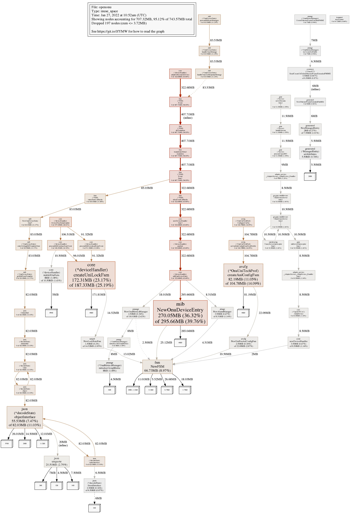
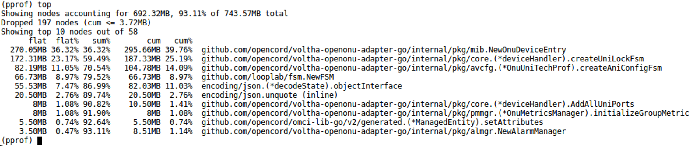
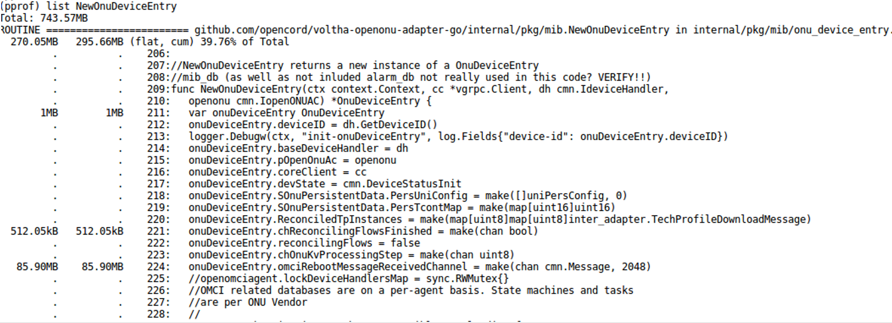
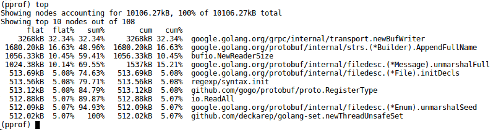

Memory Usage investigation
==========================

This page shows how to analyze the memory consumption of a VOLTHA container (written in Go) by using a
custom built image of the container and the ``pprof`` tool, provided by the GO Language.

Build an instrumented docker image
----------------------------------

If the Makefile and the Helm Charts of your image support building and deploying profiled images (should be the case),
you can create a profiled image, via the ``make docker-build`` target adding the option ``BUILD_PROFILED=true``.
The command will generate two images- the normal and the profiled one
Following is an example for the ``voltha-openonu-adapter-go``, please customize the values according to your
docker registry and desired tag:

.. code:: bash

  DOCKER_REGISTRY="hhildebr/" DOCKER_TAG="hh-dev" BUILD_PROFILED=true  make docker-build

.. code:: bash

  bbsim@bbsim:~$ docker images
  REPOSITORY                          TAG             IMAGE ID      CREATED      SIZE
  hhildebr/voltha-openonu-adapter-go  hh-dev-profile  e142bba3afea  2 hours ago  725MB
  hhildebr/voltha-openonu-adapter-go  hh-dev          8b6c5436a97d  2 hours ago  37.8MB

Deploy the instrumented image
-----------------------------

Now you can deploy VOLTHA by using the custom ``<image_name>-profile`` via helm flag.
Also the profiler flag must be activated.
Following is a snippet to put into a ``values.yaml`` file.

.. code:: bash

 voltha-adapter-openonu:
  images:
    adapter_open_onu_go:
    repository: hhildebr/voltha-openonu-adapter-go
    tag: hh-dev-profile
    pullPolicy: "Never"
  profiler:
    enabled: true

Verify and expose the profiler endpoint
---------------------------------------

To verify that the associated profiler server was started successfully and the endpoint is exposed in kubernetes,
use the following command:

.. code:: bash

  kubectl get svc --all-namespaces

The expected output is:

.. code:: bash

  NAMESPACE   NAME                                   TYPE      CLUSTER-IP EXTERNAL-IP PORT(S)  AGE
  …
  voltha      voltha-voltha-adapter-openonu-profiler ClusterIP None       <none>      6060/TCP 2h
  …

To then be able to communicate with the profile server from your host system, you have to configure an
appropriate port forwarding. An example is the following:

.. code:: bash

  kubectl -n voltha port-forward --address 0.0.0.0 svc/voltha1-voltha-adapter-openonu-profiler 6060:6060

Use the pprof tool
------------------

Static Mode
^^^^^^^^^^^

The profiling tool can be now interacted with and data retrieved.
Following is an example of how to get the heap usage of the container and save it to a file:

.. code:: bash

  curl http://127.0.0.1:6060/debug/pprof/heap > onu-go-heap.pprof

To get a first idea of the system's status, a graphical overview of the heap usage can be created from the extracted
data using the ``pprof`` tool and displayed in the browser.

.. code:: bash

  go tool pprof -http=:8080  onu-go-heap.pprof

In order to save the graphical representation of the data permanently, an image file can be created from it
(PDF-format is also supported):

.. code:: bash

  go tool pprof -png  onu-go-heap.pprof

Following is an example with heap data collected after hundreds of cycles of startup and deletion
of multiple BBSIM ONUs. The individual objects/functions can be seen there in relation to each other.
Already by the size of the boxes you can recognize the objects/functions where to find the memory leaks.

   Graphical representation of memory usage

Interactive Mode
^^^^^^^^^^^^^^^^

To start a detailed investigation, ``pprof`` is invoked in interactive mode.
Since pprof assumes by default that the code belonging to the UUT can be found in the /go/src directory,
this path part must be removed using the trim_path option and replaced with the actual directory part using
the source_path option.
Following is an example for the openonu adapter:

.. code:: bash

  go tool pprof  -source_path /home/bbsim/temp_pperf/voltha-openonu-adapter-go -trim_path /go/src /mnt/shared/onu-go-heap.pprof

by using the ``top`` command one can see which are the main originators of memory leaks,
observing the the first ten objects/functions displayed:

   Ten highest memory functions

If more object/functions are to be displayed, simply add the desired number to the command - e.g. ``top100``.

The next step is to use the ``list <function_name>`` command to view the detailed memory allocations.

Example Memory leak analysis and fix
------------------------------------
Following is an example applied for the number one of the top10, function ``NewOnuDeviceEntry``.

   List function details before optimization

Since the single allocation of ``onuDeviceEntry.omciRebootMessageReceivedChannel`` should occupy at most 100kB of
heap memory (2048 standard OMCI messages), we can conclude that the 85.90MB of occupied memory represents more
than 850 instances of ``onuDeviceEntry`` not deleted by the GC.

After removing the cause of the memory leak the same test with hundreds of cycles of startup and deletion of multiple
BBSIM ONUs shows that the issue has been solved. Having a look at the retrieved pprof data shows a significant
decrease of memory consumption, about 10MB vs 744MB without the patch:

   List function details after optimization
