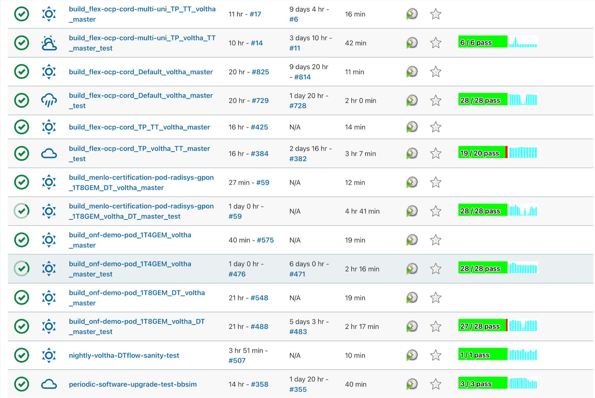

Voltha Test Automation
======================

This page shows how the Voltha tests are automated to run on
`OpenCORD Jenkins <https://jenkins.opencord.org/>`_.

Tests of different workflows, i.e. ATT, DT and TT, with various
configurations based on either BBSim deployment or actual Physical POD run
on Jenkins periodically.

   Voltha OpenCord Jenkins

Similar set of jobs are kept under similar tabs. Like,
all the master build jobs are placed under
`VOLTHA-2.X-Tests <https://jenkins.opencord.org/view/VOLTHA-2.X-Tests/>`_
tab, jobs related to the voltha-2.12 LTS release are in VOLTHA-2.12 tab.

Likewise, tests that collect measurements on Voltha performance at scale
are placed under `voltha-scale-measurements <https://jenkins.opencord.org/view/voltha-scale-measurements/>`_.

Jenkins also hosts verification jobs that trigger automatically whenever a patch
is pushed or updated on Gerrit for the review.

Job Templates
^^^^^^^^^^^^^

Templates for the jobs are defined in
`ci-management <https://github.com/opencord/ci-management>`__ repo.

BBSim Jobs
^^^^^^^^^^

OpenCORD Jenkins host a large number of BBSim based regression jobs that
run periodically with different deployment configurations to verify Voltha
control plane functionality for different operator workflows. Such as,

- `periodic-voltha-test-bbsim <https://jenkins.opencord.org/job/periodic-voltha-test-bbsim/>`_ & `periodic-voltha-multiple-olts-test-bbsim <https://jenkins.opencord.org/job/periodic-voltha-multiple-olts-test-bbsim/>`_ : tests Voltha functional scenarios, recovery and error scenarios, ONOS HA scenarios etc. for ATT
- `periodic-voltha-multi-uni-test-bbsim <https://jenkins.opencord.org/job/periodic-voltha-multi-uni-test-bbsim/>`_ & `periodic-voltha-multi-uni-multiple-olts-test-bbsim <https://jenkins.opencord.org/job/periodic-voltha-multi-uni-multiple-olts-test-bbsim/>`_ : tests Voltha functionality with multiple UNIs enabled, and with single & multiple OLT (BBSim) deployments
- `periodic-voltha-dt-test-bbsim <https://jenkins.opencord.org/job/periodic-voltha-dt-test-bbsim-master>`_ : tests functional and failure scenarios for DT workflow
- `periodic-voltha-dt-fttb-test-bbsim <https://jenkins.opencord.org/job/periodic-voltha-dt-fttb-test-bbsim-master/>`_ : tests functional scenarios for DT FTTB workflow
- `periodic-voltha-unitag-subscriber-tt-test-bbsim <https://jenkins.opencord.org/job/periodic-voltha-unitag-subscriber-tt-test-bbsim/>`_ : tests Voltha functionality with UNI-Tag Subscriber provisioning enabled for TT workflow
- `periodic-voltha-tt-maclearner-sanity-test-bbsim <https://jenkins.opencord.org/job/periodic-voltha-tt-maclearner-sanity-test-bbsim/>`_ : tests Voltha functionality with MAC Learner enabled for TT workflow
- `periodic-software-upgrade-test-bbsim <https://jenkins.opencord.org/job/periodic-software-upgrade-test-bbsim/>`_ : tests ONOS Applications, Voltha Components and ONU Software Upgrades
- `periodic-voltha-openonu-go-test-bbsim <https://jenkins.opencord.org/job/periodic-voltha-openonu-go-test-bbsim/>`_ & `periodic-voltha-multiple-olts-openonu-go-test-bbsim <https://jenkins.opencord.org/job/periodic-voltha-multiple-olts-openonu-go-test-bbsim/>`_ : tests state for ONU Go adapter with different operator workflows, different constellations and tech profiles
- `periodic-voltha-pm-data-test-bbsim <https://jenkins.opencord.org/job/periodic-voltha-pm-data-test-bbsim/>`_ & `periodic-voltha-multiple-olts-pm-data-test-bbsim <https://jenkins.opencord.org/job/periodic-voltha-multiple-olts-pm-data-test-bbsim/>`_ : tests Open ONU Go adapter PM data
- `periodic-voltha-etcd-test <https://jenkins.opencord.org/job/periodic-voltha-etcd-test/>`_ : tests Voltha etcd functionality
- `periodic-voltha-test-DMI <https://jenkins.opencord.org/job/periodic-voltha-test-DMI/>`_ : tests device management interface functionality
- `periodic-voltha-memory-leak-test-bbsim <https://jenkins.opencord.org/job/periodic-voltha-memory-leak-test-bbsim/>`_ : tests and catches memory leak in Voltha components

Similar to the above mentioned jobs which are based on **master**,
Jenkins has regression jobs for other Voltha releases as well, like
votlha-2.11 and voltha-2.12.

The template for the jobs that run on BBSim based deployment is defined
`here <https://github.com/opencord/ci-management/blob/master/jjb/voltha-e2e.yaml>`__.

BBSim based deployment is also used to test Voltha at scale.
The scale jobs run the tests that collect measurements on Voltha performance.

Scale jobs do the deployment with various combinations
like single or multiple voltha stacks with one or more BBSim based OLTs,
multiple PONs and ONUs thus testing 4000+ subscribers for different workflows.
More details about scale jobs can be found `here <https://jenkins.opencord.org/view/voltha-scale-measurements/>`__.

Hardware (or Physical POD) Jobs
^^^^^^^^^^^^^^^^^^^^^^^^^^^^^^^

OpenCord Jenkins host various regression jobs that runs on the ONF physical
pods situated at different geographical locations.  Hardware jobs test both
control and dataplane functionality of Voltha.

These hardware jobs are mostly defined in a combination of a build job and
a test job.  The template for the jobs that run on physical pod is defined
`here <https://github.com/opencord/ci-management/blob/master/jjb/voltha-test/voltha-nightly-jobs.yaml>`__.

Some of the configurations that are currently being tested on ONF's
Physical Pods are:

- Default Technology Profile with master or LTS release build for ATT
- 1T4GEM profile with master or LTS release build for ATT
- 1T4GEM-unencrypted profile with master or LTS release build for ATT
- 1T8GEM Technology Profile with master or LTS release build for DT
- 1T8GEM Technology Profile with master or LTS release build for DT with GPON based OLT setup
- 1T8GEM Technology Profile with master or LTS release build for DT with multiple OLTs setup
- Different service based Technology Profiles with master or LTS release build for TT
- Different service based profiles with master or LTS release build for TT with multiple UNIs enabled

Per-Patchset Verification Jobs
^^^^^^^^^^^^^^^^^^^^^^^^^^^^^^

The verification jobs gets triggered automatically whenever a patch is
pushed or updated on Gerrit, e.g.

- verify_{project}_licensed : This job verifies that there is valid
  license/copyright on files.
- verify_{project}_tag-collision : This job checks for changes to version
  files, and that they don't duplicate tags already in the git repo.
- verify_{project}_unit-test : This job runs the Makefile based unit tests.
- verify_{project}_sanity-test : This job verifies that basic Voltha
  functionality is not broken for any of the operator workflows.

Apart from system triggered jobs, there are some verification jobs which
can be triggered by the user by providing apt comment in the Gerrit patch,
e.g.

- *hardware test functional tests* : This comment triggers the run on a
  dedicated physical pod and executes the entire functional test suite for ATT.

- *hardware test functional tests DT* : This comment triggers the functional
  suite tests for DT.
- *voltha test openonu singleolt* :
  Triggers patchset-voltha-openonu-go-test-bbsim job.
- *voltha 2.9 test openonu singleolt* :
  Triggers patchset-voltha-2.9-openonu-go-test-bbsim job.
- *voltha 2.8 test openonu singleolt* :
  Triggers patchset-voltha-2.8-openonu-go-test-bbsim job.
- *voltha test openonu multiolt* :
  Triggers patchset-voltha-multiple-olts-openonu-go-test-bbsim job.
- *voltha 2.9 test openonu multiolt* :
  Triggers patchset-voltha-2.9-multiple-olts-openonu-go-test-bbsim job.
- *voltha 2.8 test openonu multiolt* :
  Triggers patchset-voltha-2.8-multiple-olts-openonu-go-test-bbsim job.
- *voltha test pm data singleolt* :
  Triggers patchset-voltha-pm-data-test-bbsim job.
- *voltha test pm data multiolt* :
  Triggers patchset-voltha-multiple-olts-pm-data-test-bbsim job.

The templates for the above mentioned and other similar jobs can be found
in the `ci-management <https://github.com/opencord/ci-management>`__ repo.
