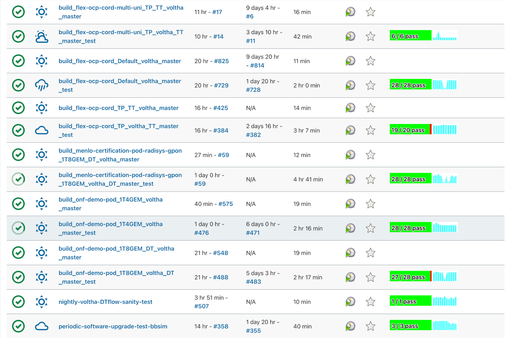

Voltha Test Automation
======================

This page shows how the Voltha tests are automated to run on `OpenCORD Jenkins <https://jenkins.opencord.org/>`_.

Tests of different workflows, i.e. ATT, DT and TT, with various configurations based on either BBSim deployment or
actual Physical POD run on Jenkins periodically.

   Voltha OpenCord Jenkins

Similar set of jobs are kept under similar tabs. Like,
all the master build jobs are placed under `VOLTHA-2.X-Tests <https://jenkins.opencord.org/view/VOLTHA-2.X-Tests/>`_ tab,
jobs related to the voltha-2.8 LTS release are in VOLTHA-2.8 tab.

Likewise, tests that collect measurements on Voltha performance at scale are placed under `voltha-scale-measurements <https://jenkins.opencord.org/view/voltha-scale-measurements/>`_,
and the Voltha Soak testing jobs are kept under the tab named `voltha-soak <https://jenkins.opencord.org/view/voltha-soak/>`_.

Jenkins also host `verification jobs <https://jenkins.opencord.org/view/VOLTHA%202.x%20verify/>`_ that trigger automatically whenever a patch is pushed or updated on Gerrit for the review.

Job Templates
-------------

Templates for the jobs are defined in `ci-management <https://github.com/opencord/ci-management>`_ repo.

BBSim Jobs
^^^^^^^^^^

The template for the jobs that run on BBSim based deployment is defined `here <https://github.com/opencord/ci-management/blob/master/jjb/voltha-e2e.yaml>`__.

Below is the example on how a BBSim job can be created.

.. code:: bash

      - 'voltha-periodic-test':
          name: 'periodic-voltha-multiple-olts-test-bbsim'
          code-branch: 'master'
          olts: 2
          extraHelmFlags: '--set global.image_tag=master --set onos-classic.image.tag=master --set onu=2,pon=2'
          time-trigger: "H H/23 * * *"
          testTargets: |
            - target: functional-multi-olt
              workflow: att
              flags: ""
              teardown: true
              logging: true
            - target: bbsim-multiolt-failurescenarios
              workflow: att
              flags: ""
              teardown: false
              logging: true
            - target: bbsim-multiolt-errorscenarios
              workflow: att
              flags: ""
              teardown: false
              logging: true
            - target: bbsim-multiolt-kind
              workflow: att
              flags: ""
              teardown: false
              logging: true

Hardware (or Physical POD) Jobs
^^^^^^^^^^^^^^^^^^^^^^^^^^^^^^^

The template for the jobs that run on physical pod is defined `here <https://github.com/opencord/ci-management/blob/master/jjb/voltha-test/voltha-nightly-jobs.yaml>`__.

The hardware jobs are mostly defined in a combination of a build job and a test job.
Below is the example on how these jobs are created.

.. code:: bash

      # flex OCP pod with olt/onu - Released versions Default tech profile and timer based job
      - 'build_voltha_pod_release_timer':
          'disable-job': false
          build-node: 'qa-testvm-pod'
          config-pod: 'flex-ocp-cord'
          release: 'master'
          branch: 'master'
          name-extension: '_TT'
          work-flow: 'TT'
          profile: 'TP'
          time: '10'
          VolthaEtcdPort: 9999
          num-of-onos: '3'
          num-of-atomix: '3'

      # flex pod1 test job - released versions: uses tech profile on voltha branch
      - 'build_voltha_pod_test':
          'disable-job': false
          build-node: 'qa-testvm-pod'
          config-pod: 'flex-ocp-cord'
          release: 'master'
          branch: 'master'
          name-extension: '_TT'
          work-flow: 'TT'
          power-switch: True
          pipeline-script: 'voltha/master/voltha-tt-physical-functional-tests.groovy'
          test-repo: 'voltha-system-tests'
          profile: 'TP'
          timeout: 360
